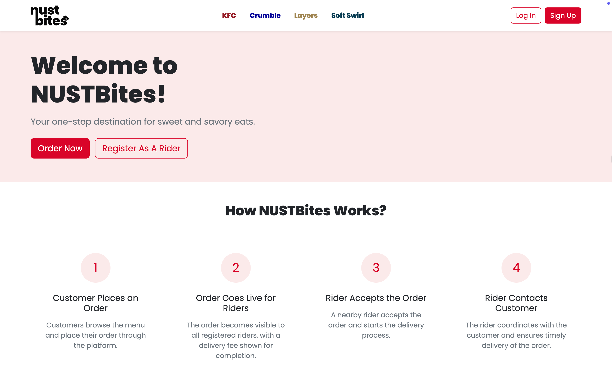
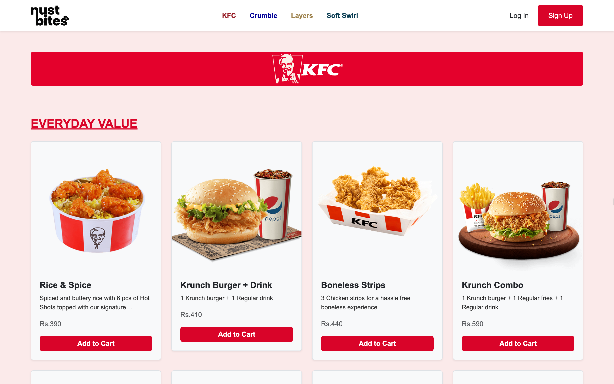
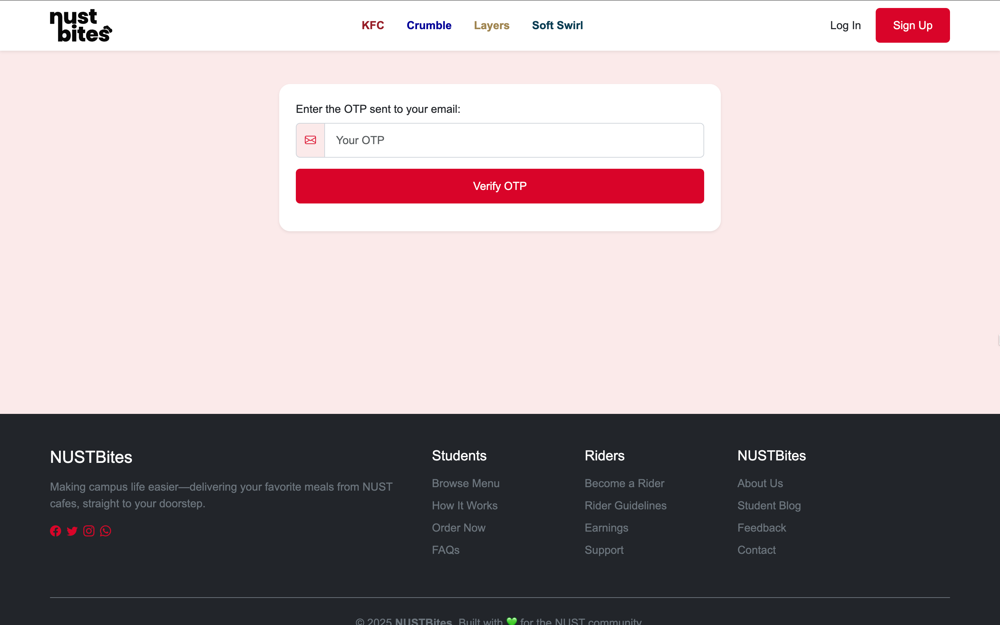

# 🍔 NUSTBites

Welcome to **NUSTBites**, a static web application crafted with ❤️ for the NUST community!  
It brings together your favorite campus meals under one digital roof.

---

## 🌐 Project Overview

NUSTBites is a **responsive**, **Bootstrap-based** static web app that:

- 📋 Dynamically displays a menu from a CSV file
- 📱 Adapts to different screen sizes (mobile, tablet, desktop)
- 🎨 Follows a custom KFC-inspired red theme
- 🍽️ Categorizes menu items for better navigation
- ✅ Shows availability and pricing
- 📦 Designed with simplicity, functionality, and performance in mind

---

## 📸 Preview






## 📁 File Structure

```
/project-root
│
├── public/
│   ├── logos/ → static SVGs
│   ├── screenshots/ → Screenshots of the app
│   │   ├── 01.png
│   │   ├── 02.png
│   │   ├── 03.png
│   │   └── 04.png
│   ├── kfc menu.csv → Dummy Menu data (CSV format)
│   ├── favicon.ico → Website favicon
│   └── logo-main-light.svg → Main logo
│
├── public/css/
│   ├── generalStyle.css → General page styles
│   ├── auth.css → Auth page styling
│   ├── order-dashboard.css → Order dashboard styles
│   └── specificStyle.css → Page-specific styles
│
├── index.html → Landing page (optional)
├── menu.html → Main menu page
├── auth.html → Authentication page
├── order-dashboard.html → Dashboard for orders
├── otp.html → OTP verification page
└── README.md → You're reading it 😄
```

---

## 📦 Features

### ✅ Responsive Layout

- At least **2 items on mobile**
- Auto-adjusts number of items per row for tablets and desktops

### 📊 Data Driven

- Loads from: public/kfc menu.csv
- Categorizes by Category
- Each menu card shows:
  - 🍔 Name
  - 📄 Description (up to 2 lines)
  - 💰 Price
  - 🖼️ Image

### 📷 Menu Cards

- Uses Bootstrap 5.3 cards
- Responsive grid layout
- Category headers are:
  - Underlined
  - Primary green colored
  - Bold
  - Margin added except for first one

## 🛠️ Technologies Used

- HTML5
- CSS3 + Bootstrap 5.3
- JavaScript (Vanilla)
- Bootstrap Icons
- CSV parsed via fetch()

## 🚀 How to Run

1. Clone or download this repository
2. Open LandingPage.html in a browser
3. Ensure browser allows file access (some block local CSV fetch)
4. ✅ Done!

## ✨ Future Improvements

- Add "Add to Cart" button with interactivity
- Sync menu with Google Sheets
- Add filtering / search feature
- User login / authentication

## 👨‍💻 Authors

Built for the NUST community with 💚

Created by:

- Junaid Alam
- Taaha Bin Zaheer
- Hamza Bin Abdul Hanan
- Rehan Hussain

BSCS-13 E – Contributions welcome!
